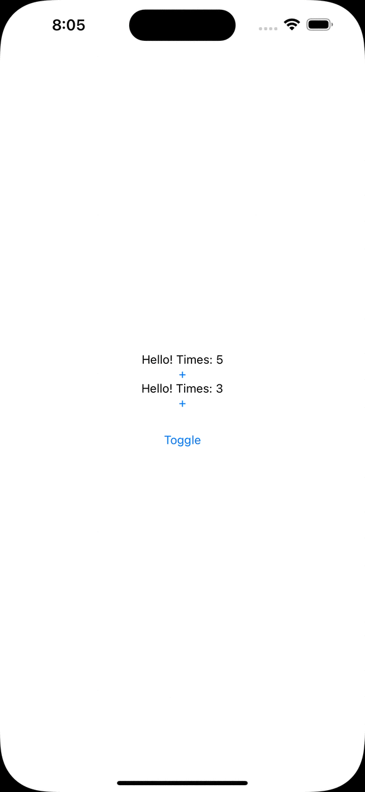

# New in SwiftUI: AnyLayout

This is a code from the YT video "New in SwiftUI: AnyLayout" 🤗

You will learn about the new AnyLayout in SwiftUI. This new feature will help you to change the layout of your app dynamically without losing the state of the subviews. Enjoy 🤓

## Links:
- [Link to the video](https://www.youtube.com/watch?v=mBPZ5XMPFWc)
- [AnyLayout](https://developer.apple.com/documentation/swiftui/anylayout)